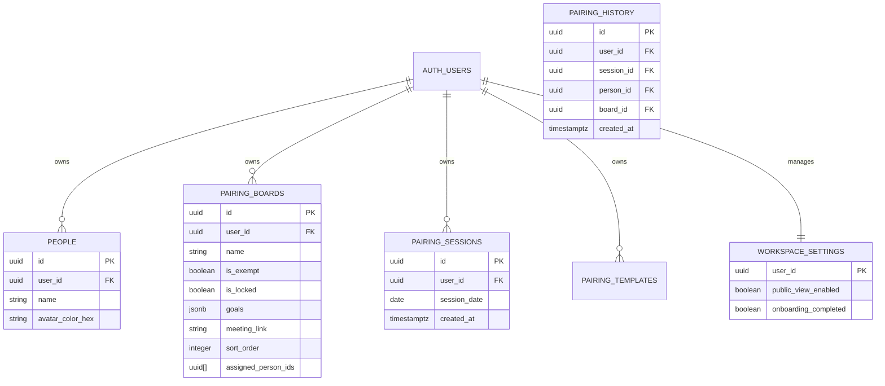
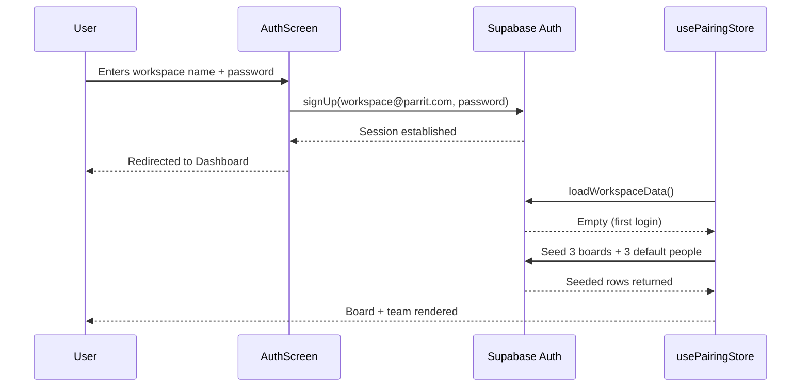
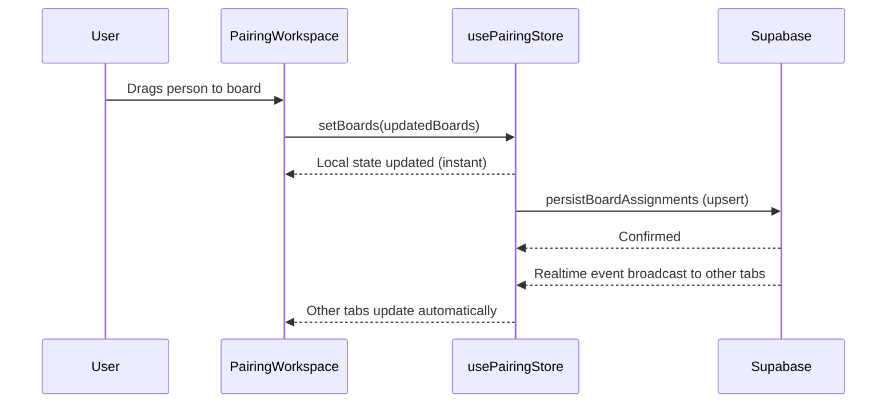

# Architecture: Parrit

This document describes the current architecture of the application as implemented.

## Database Schema (Supabase)

Two tables, both scoped per workspace via `user_id`.

**Key design decisions:** 
- **Board assignments** are stored as a `uuid[]` array directly on `pairing_boards.assigned_person_ids`. This simplifies drag-and-drop persistence — a single upsert per drag event updates the whole board state.
- **History** is decoupled into `pairing_sessions` (the "when") and `pairing_history` (the "who/where"). This allows for back-dating and analytics while maintaining a record of exactly when the snapshot was taken.
- **Locked Boards**: The `is_locked` flag prevents the `recommendationEngine` from rotating people on specific boards, allowing for continuity in specific workstreams.

Row Level Security (RLS) ensures each workspace (`auth.users` row) can only read and write its own rows.

See `supabase/schema.sql` for the full setup script.

---

## State Management

Zustand is used for all client-side state:

| Store             | Location                  | Responsibility                            |
| ----------------- | ------------------------- | ----------------------------------------- |
| `useAuthStore`    | `features/auth/store/`    | Session, user, workspace name             |
| `usePairingStore` | `features/pairing/store/` | People, boards, all CRUD + real-time sync |
| `useToastStore`   | `store/`                  | Global toast notifications                |

---

## Real-time Sync

`usePairingStore.subscribeToRealtime()` opens a Supabase Realtime channel that listens to `postgres_changes` on both `people` and `pairing_boards`. Incoming events are diffed against local state and applied minimally (insert/update/delete). The subscription is established after login and torn down on sign-out via the `useEffect` cleanup in `App.tsx`.

---

## Authentication Model

Workspaces use a **pseudonym email strategy**: the workspace name entered by the user is combined with a fixed domain (`@parrit.com`) to form a synthetic email, which is passed to Supabase's email/password auth. This means:

- No real email address is collected
- No email confirmation inbox is required (disabled in Supabase dashboard)
- Each workspace is a distinct Supabase auth user — data is isolated by `user_id`

See [ADR-0001](../adr/0001-workspace-pseudonym-authentication.md) for full rationale.

---

## Key User Journeys

### Sign-up and first load

### Drag-and-drop pairing

