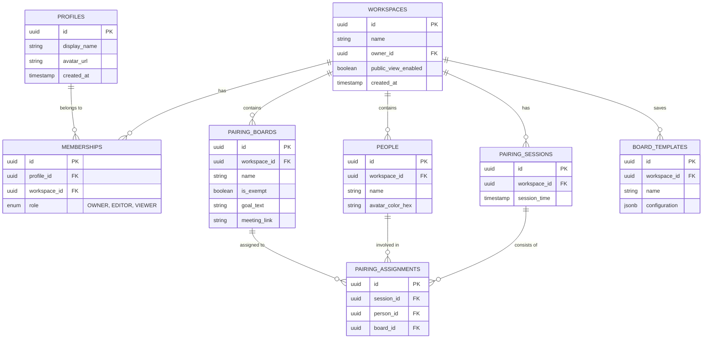
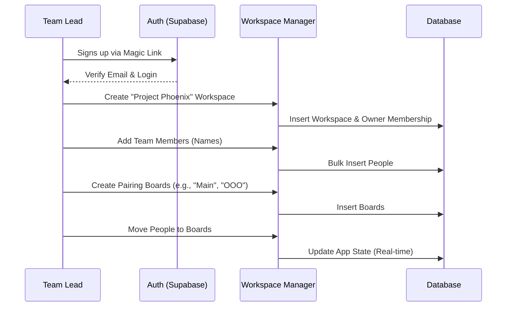
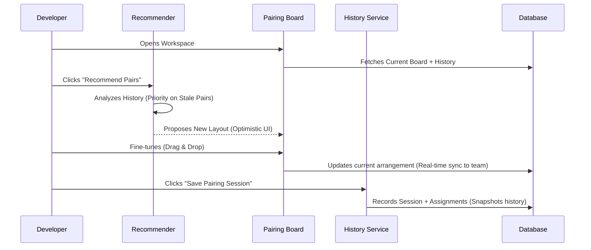
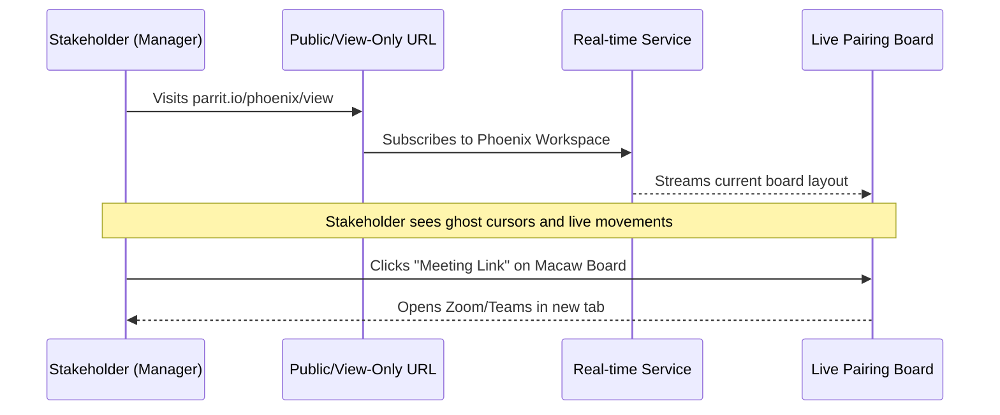

# Architecture & User Journeys: Parrit Modern

This document visualizes the data model and the key user journeys for the "Ideal" version of Parrit.

## 1. Database Schema (Supabase)

---

## 2. Key User Journeys

### Journey A: New Team Onboarding
*Goal: A team lead sets up a fresh workspace for their team.*

---

### Journey B: Daily Pairing Rotation (The "Core Loop")
*Goal: Rotate pairs based on recommendations and save history.*

---

### Journey C: Stakeholder Review
*Goal: A manager checks pairing status without logging in.*

