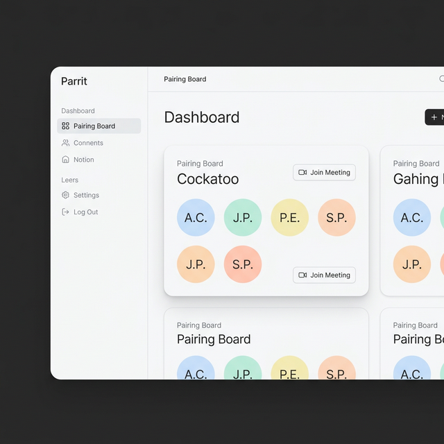

# UI Design System: Parrit Modern (Human-Centric)



This document defines the "Human Modern" aesthetic for the Parrit rebuild—prioritizing clarity, softness, and a professional "non-AI" feel.

## 1. Design Philosophy: "Human Modern"
- **Tactile Surfaces**: Moving away from neon light-panels to "physical" surfaces. Cards have soft, diffused contact shadows that make them feel grounded.
- **Generous Whitespace**: Focus on breathing room and clarity. Information is not crowded.
- **Curated Palette**: Using sophisticated neutrals and soft pastels instead of high-saturation neon colors.
- **Refined Typography**: Friendly but professional sans-serifs that feel "crafted" rather than "default."

---

## 2. Core Tokens

### Color Palette
### Shared Tokens
- **Primary**: `Indigo-500` (#6366f1) - Soft, vibrant focus color.
- **Avatars**: Soft, muted tones (Sage, Dusty Rose, Slate Blue).
- **Typography**: `Plus Jakarta Sans` - Friendly, structured geometric sans-serif.

### Light Mode (The "Paper" Aesthetic)
- **Background**: `Neutral-50` (#fafafa) - Clean and bright.
- **Surface**: `White` (#ffffff) - Cards with soft, diffused shadows.
- **Border**: `Neutral-200` (#e5e5e5) - Low-contrast separator.
- **Text**: `Neutral-900` (#171717) - Crisp and readable.

### Dark Mode (The "Night" Aesthetic)
- **Background**: `Neutral-950` (#030712) - Deep, ink-charcoal.
- **Surface**: `Neutral-900` (#171717) - Grounded cards with subtle contact shadows.
- **Border**: `Neutral-800` (#262626) - Minimalist structure.
- **Text**: `Neutral-100` (#f5f5f5) - Soft, high-readability white.

---

## 3. Key Components

### A. The "Human" Avatar
- **Visuals**: Clean circles with initials. Use a "Subtle Grain" texture or a very soft gradient to make them feel less like flat digital circles.
- **Shadows**: A small drop shadow to give them a "sticker" feel on the card.

### B. Workspace Cards (Boards)
- **Design**: Solid background with a very thin, low-contrast border (`Neutral-800`).
- **Rounded Corners**: A softer, larger radius (12px - 16px) for a friendlier feel.
- **Header**: Clear, hierarchical titles with simple line-art icons (Feather/Lucide style).

### C. Interactions
- **The "Hold" State**: When grabbing a person, they lift slightly with a larger shadow, as if you've picked up a physical pebble.
- **The "Drop" Zone**: A dashed border with a soft background wash, guiding the user without shouting at them.

---

## 4. Main Workspace Layout

```
+-------------------------------------------------------------+
| [ Logo ]         [ Dashboard ]  [ Team ]   [ Settings ]     |
|-------------------------------------------------------------|
|                                                             |
|   Current Pairing Workspace: Phoenix                         |
|                                                             |
|   +-------------------+       +-------------------+         |
|   |  COCKATOO         |       |  MACAW            |         |
|   |  [AM] [JS]        |       |  [RK] [BD]        |         |
|   |                   |       |                   |         |
|   |  Goal: Auth UI    |       |  Goal: API Fix    |         |
|   +-------------------+       +-------------------+         |
|                                                             |
|   [ Unpaired ]                [ Recommend Pairs ] [ Save ]  |
|   [TC] [LW] [SN]                                            |
+-------------------------------------------------------------+
```

## 5. Why this feels "Human"
- **Less Distraction**: No glowing light-beams; the focus is on the people and their goals.
- **Consistent Grid**: Everything follows a mathematically sound but visually "soft" grid.
- **Clarity over Flash**: The UI doesn't try to "wow" with tech-demos; it "wows" with how quickly you can do your job.
